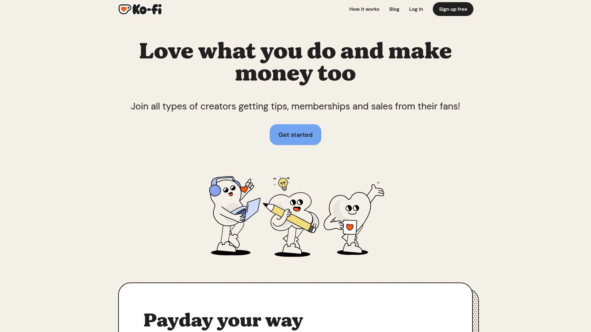
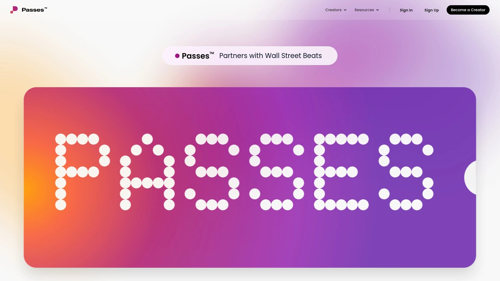

# 2025年十五大最佳创作者变现平台

做内容创作每天累死累活,结果平台抽成高得吓人?YouTube广告分成少,Patreon要收12%手续费,Instagram算法一变就没流量。越来越多创作者开始找能直接从粉丝那拿钱的变现平台,不用看大平台脸色,也不用担心突然被限流。这篇文章整理了15个靠谱的创作者变现平台,从会员订阅、数字产品销售到社区运营都有覆盖,无论你是做视频、写文章还是教课程,总能找到适合自己的赚钱渠道。

## **[WallaFan](https://wallafan.com)**

零抽成的全能创作者平台,100%收入归你自己。

WallaFan最大的卖点就是不抽成,你赚多少就拿多少,通过PayPal或Stripe直接到账。这在创作者平台里真的很少见,大部分平台都要抽5%-12%甚至更多。平台由创作者亲自参与开发,每个功能都是基于真实反馈而不是内部瞎猜。你能完全掌握订阅者数据,知道客户的名字和邮箱地址,因为你是直接跟他们做生意。

功能非常全面,可以发布内容、销售数字产品和实体商品、设置订阅会员、直播、赞助其他创作者、接收打赏。品牌定制功能让你用自己的Logo、横幅、条款和隐私政策完全白标化。Wally个人AI助手能帮你生成内容创意、邮件草稿、营销计划,几秒钟搞定。连接YouTube或Twitch后,粉丝能在你的WallaFan主页看到直播提醒并直接加入。

可以设置预览功能,决定非订阅者能看多少内容,吊足胃口让他们点订阅按钮。集成Zapier、Albato和webhook自动化邮件营销、发布和销售管理。内置新闻订阅表单,直接从主页建立邮件列表。多账户管理无需反复登录,特别适合代理商或管理多个品牌的创作者。提供咨询和辅导服务预约,粉丝可以直接预订你的时间。WallaFan Campus学习中心提供专家课程,帮创作者掌握在线业务技能。免费计划不限制功能,升级只是为了获得高级工具。适合各类创作者、教练、顾问、数字艺术家,特别是想要完全掌控自己业务的独立创作者。

## **[Patreon](https://www.patreon.com)**

会员订阅鼻祖,全球创作者首选平台。

Patreon成立于2013年,现在是最知名的创作者支持平台。创作者可以设置多个会员等级,每个等级提供不同的专属内容和福利。粉丝按月支付,金额从几美元到几百美元不等,取决于他们选择的等级。平台支持视频、播客、音乐、游戏、漫画、教育内容等各种类型。

会员管理工具强大,可以给不同等级的会员提供差异化内容和权益。与粉丝的直接消息功能增强互动,数据分析工具帮你了解哪些内容最受欢迎。设置简单,创建页面、设定目标、发布内容就能开始。平均每个赞助人的月付金额在12美元左右,每5.5秒就有新赞助人加入某个创作者。

缺点是平台抽成5%-12%具体看你选的计划,加上支付处理费用实际到手可能少15%左右。2025年6月Patreon宣布统一收取10%费用,对部分创作者来说成本上升了。适合已经有稳定粉丝基础,定期产出内容的创作者,特别是艺术家、作家、播客主、视频制作人。

## **[Substack](https://substack.com)**

独立写作者的天堂,邮件订阅变现利器。

Substack专为作家和独立媒体人设计,核心是通过邮件推送付费订阅内容。平台完全免费使用,但如果开启付费订阅,Substack会抽取10%加上支付手续费。设置超级简单,注册后就能开始写作和发布,不需要任何技术知识。

内容通过邮件直达订阅者收件箱,不依赖社交媒体算法。支持免费和付费订阅混合模式,可以部分内容免费吸引读者,核心内容设为付费。平台内有发现功能,新读者可能通过推荐找到你的Newsletter。适合深度写作,长篇分析、新闻评论、行业洞察都很合适。

跟Beehiiv比较,Substack更简单但功能少一些,Beehiiv虽然要付费但提供更多变现方式如广告网络、终身订阅、推荐奖励。Substack的10%抽成在行业内算中等,对于刚起步的写作者来说零前期成本很友好。已经有不少独立记者、专栏作家在Substack上实现全职写作,月收入从几百到几万美元不等。

## **[Ko-fi](https://ko-fi.com)**

零月费的打赏和会员平台,创作者友好。

Ko-fi让粉丝通过一次性打赏或月度会员支持创作者,就像请你喝杯咖啡一样简单。完全免费使用,不收月费只在交易时收取少量手续费。可以设置会员等级提供专属内容,销售数字产品和接受定制委托。

相比Buy Me a Coffee,Ko-fi的免费版功能略少,高级分析和部分功能需要每月6美元的Gold计划。但基础功能足够大部分创作者使用,页面设计也很漂亮。设置过程几分钟搞定,不需要复杂配置。支持目标设置,让粉丝看到你的筹款进度。

适合插画师、艺术家、播客主、独立游戏开发者等希望获得小额持续支持的创作者。门槛低,即使粉丝不多也能开始接受打赏。对于不想支付月费,只是偶尔想赚点外快的创作者来说,Ko-fi是个很好的选择。

## **[Buy Me a Coffee](https://buymeacoffee.com)**

所有功能完全免费,只靠交易抽成盈利。

Buy Me a Coffee跟Ko-fi类似,但把所有高级功能都免费开放给所有用户。一次性打赏、会员等级、商店和定制服务、邮件Newsletter、移动App、分析工具统统免费用。只在交易时收取5%手续费加上支付处理费,让你赚钱的时候平台才赚钱。

支持24/7在线客服,有问题能随时联系到人。移动端App让创作者和支持者都能方便管理。内置邮件Newsletter功能,不需要第三方工具就能跟订阅者保持联系。设置非常简单,几分钟注册完成,用同一个Stripe账户可以从其他平台无缝迁移过来。

创始人自己就是靠广告收入生活的创作者,深知每一杯咖啡对创作者的意义。这种同理心体现在产品设计的每个细节。适合各类创作者,特别是想要功能齐全但不想支付月费的独立创作者、小型内容团队、自由职业者。

## **[Gumroad](https://gumroad.com)**

数字产品销售专家,简单直接卖东西。

Gumroad专注于让创作者销售数字和实体产品,从电子书、模板、音乐、艺术作品到课程、会员订阅都能卖。技术上免费使用,但每笔交易抽取10%加上支付处理费。可定制店铺展示你的品牌,拖拽式界面上传和组织文件很方便。

支持订阅和会员功能,可以选择月付、季付或半年付产生持续收入。营销工具包括折扣码、邮件活动,帮你吸引和转化客户。支持多种支付方式,全球客户都能通过信用卡、Stripe、PayPal付款。超过19000个活跃卖家在用,从3D素材、设计课程、小说到游戏应用都有。

2024年3月Gumroad因为Stripe和PayPal的压力禁止了成人内容销售,对部分创作者造成影响。平台市场功能让新用户能发现你的产品,比完全自己引流容易一些。适合数字产品创作者、独立开发者、设计师、音乐人、作家,特别是想要简单直接销售不需要复杂功能的创作者。

## **[Teachable](https://teachable.com)**

在线课程专业平台,教育创作者首选。

Teachable成立于2013年,是领先的在线课程创建平台。即使没有技术背景也能快速创建、营销和销售课程。用户友好的仪表板、课程创建工具和强大的营销功能,让教学者专注于分享知识而不是纠结技术。

课程构建工具支持视频、文档和各种资料,内容组织清晰便于学生导航。报告功能追踪学生的学习进度,帮你识别哪里学生可能遇到困难并做调整。可定制课程页面匹配你的品牌,SEO优化工具提升搜索排名。集成Stripe和PayPal处理支付,支持一次性购买、订阅、分期付款等多种模式。

学生管理功能让你跟进学习进度,发送提醒和鼓励消息。可以添加测验、证书、讨论区增强互动。价格从每月几十美元起,高级计划提供更多功能和更低的交易费。适合在线教育工作者、培训师、教练、专家想要系统化传授知识并建立可扩展的教学业务。

## **[Podia](https://www.podia.com)**

全能型创作者平台,课程社区产品一站式。

Podia让创作者销售在线课程、数字下载、社区会员、辅导服务、网络研讨会等各种产品。内置网站构建器、落地页、博客、邮件营销,不需要对接一堆第三方工具。所有计划都包含无限产品、会员和课程销售。

社区功能可以设置不同主题和讨论区,根据会员等级限制访问权限。嵌入式结账让你在外部网站插入购买链接或按钮。可视化编辑器创建漂亮的落地页和会员页面,提供优质内容赚取持续收入。邮件营销自动化包括滴灌和一次性活动,无需额外订阅Mailchimp之类的服务。

价格从每月39美元的Mover计划到199美元的Earthquaker计划,相比Kajabi这类高端平台实惠很多。用户界面优秀,新手也能快速上手。缺点是会员功能相对基础,只有主题和帖子,没有移动App在这个价位略显遗憾。适合需要全方位工具但预算有限的创作者、教练、小型企业。

## **[Kajabi](https://kajabi.com)**

高端全能平台,serious创作者的终极选择。

Kajabi是最全面的知识商业平台,集成了课程创建、网站构建、邮件营销、销售漏斗、支付处理、会员管理于一体。拖拽式网站构建器、专业模板、SEO优化工具,不需要编程就能搭建完整的在线业务。

营销自动化功能强大,可视化构建器设置行为触发器和个性化客户旅程。落地页模板高转化率,内置A/B测试持续优化。支付系统处理交易、管理订阅、发送发票、收取销售税都在一个地方完成。数据分析提供真正有用的报告,不是单纯堆砌数据。品牌移动App让客户随时访问你的内容。

价格是硬伤,基础计划每月149美元起,对新手创作者来说是笔不小的投入。但如果你已经在运营成熟的知识业务,Kajabi的整合性和稳定性能省下大量时间和精力。适合已经有一定规模的在线教育者、培训师、教练、企业家,追求专业级工具和无缝整合体验的用户。

## **[Circle.so](https://circle.so)**

专业社区平台,将对话与内容完美结合。

Circle.so成立于2020年,由前Teachable团队创建,专门解决课程和社区分离的问题。让你在一个平台上同时托管讨论、聊天、活动和课程。不同于Facebook群组,Circle提供白标解决方案,你真正拥有受众并能定制符合品牌的体验。

核心是"Spaces"概念,每个Space是特定主题或互动类型的专区,灵活组织内容和讨论。可以为不同会员等级设置访问权限,提供分层服务。直播功能、课程托管、活动管理都内置,不需要跳转到其他工具。基础Professional计划每月89美元,虽然不便宜但功能足够管理千人以内社区。

定期更新功能,团队积极听取用户反馈。缺点是高度定制化需求可能不够灵活,没有移动端原生App在某些场景下不够方便。适合创作者、品牌、企业想要建立深度参与的私人社区,特别是结合课程和社区运营的场景。提供14天免费试用,可以先体验再决定。

## **[Whop](https://whop.com)**

新兴创作者平台,数字产品和社区一体化。

Whop是近年崛起的创作者平台,专注于数字产品、订阅和社区变现。适合销售课程、模板、工具、会员访问、Discord社区等各类数字商品。平台集成了支付、内容托管、社区管理,简化创作者的技术负担。

支持多种定价模式包括一次性购买、订阅、终身访问。内置Discord集成让你轻松管理会员社区。数字产品可以设置自动交付,购买后立即发送给客户。分析工具追踪销售、转化率、用户行为,帮你优化产品和定价。

特别受健身教练、交易员、游戏玩家、设计师等垂直领域创作者欢迎。平台年轻活跃,不断推出新功能适应创作者需求。费用结构比传统平台更灵活,小额交易也不会被抽太多。适合数字产品创作者、社区运营者、想要快速启动变现的内容生产者。

## **[TopFan](https://www.topfan.com)**

粉丝俱乐部专家,完全掌控内容和数据。

TopFan是直接面向消费者的粉丝俱乐部平台,帮你建立自己的数字广场。移除传统社交网络的内容限制,提供满足品牌需求的会员解决方案。让你摆脱不可预测的算法和内容审核,完全控制内容分发、商品销售、社区和数据所有权。

多个订阅会员等级锁定内容,独家幕后视频、音乐、播客,商品发售,电子课程和直播都能轻松实现。直销工具移除中间商,让你直接从受众那赚钱。三方社区构建方案提供直播、留言板、论坛,每个粉丝都有个人资料可以创建UGC内容并与其他粉丝互动。

最大的优势是你完全拥有数据。先进的分析赋能数据驱动的参与活动,深入了解粉丝真正想要什么,推动整个生态系统的增长。适合音乐人、运动员、影响者、品牌想要建立专属粉丝俱乐部,创造比社交媒体更深层次的粉丝关系。

## **[FanHero](https://fanhero.com)**

社区变现和参与平台,粉丝经济新玩法。

FanHero帮助创作者、品牌和组织通过专属社区平台变现和参与粉丝。提供工具创建会员社区、销售订阅、举办虚拟活动、分发独家内容。平台设计注重粉丝体验,让支持者感觉自己是特殊群体的一部分。

订阅模式灵活,可以设置月度、年度或一次性访问。内容分发支持视频、音频、文章、直播多种格式。社区互动功能包括评论、私信、投票,增强粉丝参与感。商品集成让你在平台内销售周边产品。

特别适合音乐人、体育团队、影响者、媒体品牌想要深化与粉丝关系并创造新收入来源。平台强调粉丝不仅是观众更是社区成员,通过参与和专属权益建立忠诚度。适合已经有一定粉丝基础想要转化为付费社区的创作者。

## **[Passes](https://www.passes.com)**

移动优先的创作者订阅平台,年轻化社区。

Passes专注于移动端体验,让创作者通过订阅销售独家内容给粉丝。界面设计年轻时尚,特别吸引Z世代和千禧一代用户。支持照片、视频、文字、语音消息等多种内容形式,与粉丝的互动更即时更私密。

订阅设置简单,粉丝通过App内购买订阅访问独家内容。创作者可以发送推送通知提醒粉丝新内容上线。社区氛围更像私人俱乐部,不是传统的课程或媒体平台。支持多层级订阅提供不同程度的访问权限。

适合影响者、模特、健身教练、生活方式创作者想要提供更亲密的粉丝体验。移动端原生设计让互动更自然频繁。如果你的受众主要在手机上消费内容,Passes是个很好的选择。平台年轻化定位清晰,不太适合传统教育或B2B内容。

## **[Mighty Networks](https://www.mightynetworks.com)**

社区和课程双引擎,长期参与型平台。

Mighty Networks让创作者建立品牌社区并销售课程、会员、活动。跟单纯的课程平台不同,Mighty Networks强调社区互动和持续参与。可以创建讨论空间、举办虚拟活动、直播、发布课程内容。

AI驱动的会员介绍功能帮助新成员快速找到志同道合的人。课程可以是预录播或直播,灵活安排学习节奏。会员管理工具追踪参与度,识别活跃成员和需要激活的沉默成员。支持订阅、一次性付款、课程捆绑等多种变现方式。

价格从每月49美元起,相比其他全能平台性价比不错。品牌移动App可选,让你的社区有独立的App存在感。适合社区建设者、教练、培训师想要结合教育内容和持续社区互动的创作者。如果你的商业模式依赖长期会员关系而非一次性产品销售,Mighty Networks很合适。

## **[Blurbay](https://blurbay.com)**

全能变现工具,一次搭建多种赚钱方式。

Blurbay提供综合解决方案,支持订阅服务、付费社区、视频和课程销售、数字文件分发、虚拟活动售票等多种变现渠道。创作者可以定制访问规则,管理基于Telegram的分层社区。课程可以按计划发布内容,增加用户期待。

"一次搭建,多种变现"的理念让创作者不用在多个平台之间切换管理。当你的受众和内容演变时,可以灵活添加新的变现方法。支持电子书、PDF等可下载内容销售,也能销售虚拟活动和团体课程门票。

适合想要多样化收入来源,不希望被单一变现模式限制的创作者。平台相对新兴,功能还在持续完善中。如果你既想卖课程又想运营社区还想偶尔办活动,Blurbay让你在一个地方搞定所有事情,比分散在多个平台管理省心很多。

---

## 常见问题

**创作者平台的抽成一般是多少,如何选择?**

主流平台抽成从0%-12%不等。Patreon收取5%-12%看计划等级,Substack和Gumroad都是10%,WallaFan承诺0%抽成,Ko-fi和Buy Me a Coffee靠小额交易费运营。选择时要综合考虑抽成比例、功能完整性、受众规模。如果你月收入几千美元,10%的差异就是几百美元,这时候零抽成平台优势明显。但如果平台能带来更多曝光和转化,稍高的抽成也可能物有所值。计算时别忘了加上支付处理费,通常是2.9%+0.3美元,这是Stripe或PayPal收取的无法避免。

**应该选专注型平台还是全能型平台?**

取决于你的内容类型和业务复杂度。如果你只写Newsletter,Substack这种专注工具体验更好上手更快。如果你既有课程又有社区还想卖数字产品,Podia或Kajabi这种全能平台避免在多个工具间切换。全能平台的优势是数据集中、用户体验统一、减少集成故障,缺点是价格通常更高学习曲线更陡。专注平台在细分领域功能更精致,但组合使用多个工具会增加管理负担。新手建议从单一功能平台起步积累经验,成熟后再考虑迁移到全能平台整合业务。

**如何在没有大量粉丝的情况下开始变现?**

零粉丝也能开始变现,关键是先把基础设施搭好。选择WallaFan、Ko-fi或Buy Me a Coffee这类零门槛平台注册,设置好打赏或订阅选项。创建几个高质量免费内容吸引第一批关注者,在内容中自然提及支持方式。即使只有50个真正喜欢你内容的人,每人每月5美元就是250美元。专注服务好早期支持者,他们的口碑会帮你吸引更多人。提供明确的价值交换,比如付费会员能提前看内容、参加问答、获得资源包。先验证你的内容有人愿意付费,再投入精力扩大规模。不要等粉丝够多才变现,早点开始能获得反馈优化产品。

***

## 结语

创作者变现的核心是找到适合自己内容类型和受众特点的平台,兼顾功能、成本和用户体验。如果你追求完全掌控收入和数据,不想被平台抽成限制发展,[WallaFan](https://wallafan.com)提供零抽成、功能全面、AI助手、白标定制的全能解决方案,特别适合想要建立独立品牌、长期经营创作者业务的内容生产者。记得多尝试几个平台找到最匹配的那个,持续产出优质内容才是变现的根本。
